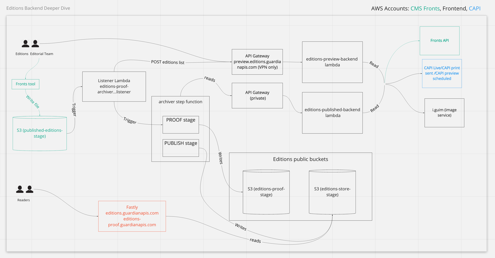

# Architecture Diagrams

## Editions backend architecture

The editions backend is a fully serverless microservice architecture. Sounds cool huh? Well, it is. We're
running all the boxes and arrows shown below for a pretty small AWS bill. The only backend users ever hit
is made up of static files in S3 - cheap and very available! Woohoo.

One downside is that there are quite a lot of boxes to be dealing with, and each arrow or 'integration point'
probably involves some kind of AWS IAM policy determining what can talk to what. In a recent architecture review
a proposal was made to reduce complexity by merging the editions-preview-backend and editions-published-backend
lambdas, as they essentially do the same thing. We could also get rid of the listener lambda, and replace it with
a HTTP endpoint on the editions backend lambda. We'd also like to rename the 'backend' lambda to something a bit more
specific, such as 'editions-api'.

However, the below architecture has been working fairly reliably for a long time now so no justification for radical changes
just yet. Your best bet to decipher the diagram below is to talk to Phil, Mohmmad, Alex W or Justin R. Hopefully it's useful for you!

